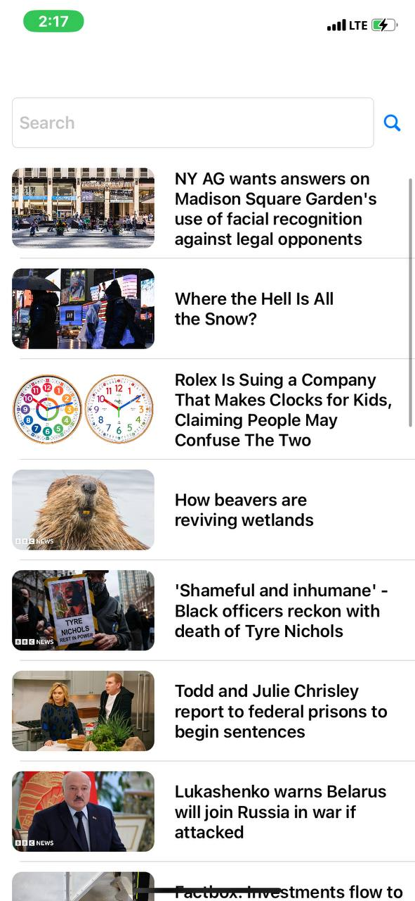

# News App

This is an iOS app that displays the list of news provided by NewsAPI.org.

Main features: searching news by a keyword, opening more details about the news and possibility of opening the selected news in a WebView. Fetched news are saved in UserDefaults in order to preserve them in the cache when application is closed or internet is not available.

